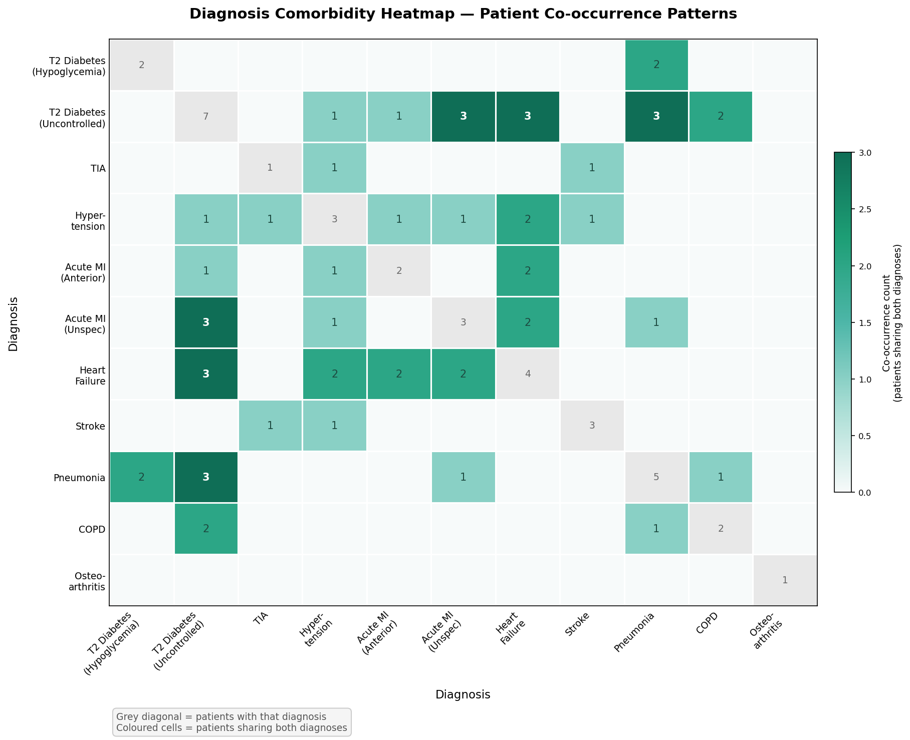
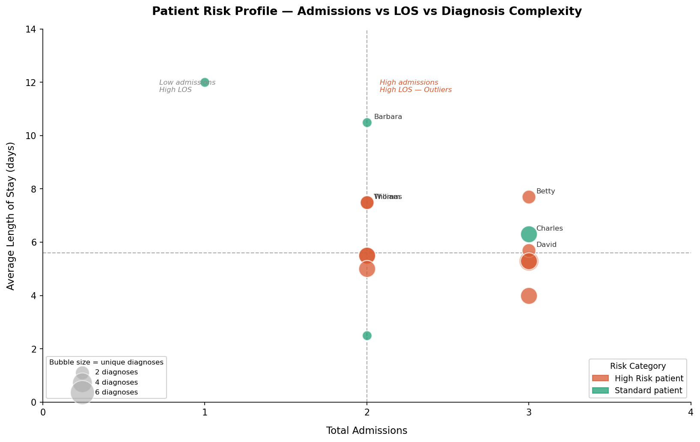
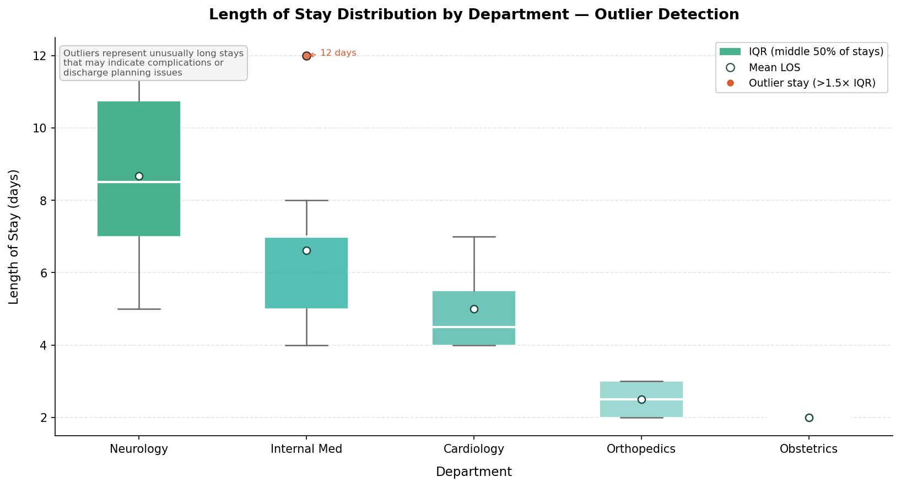
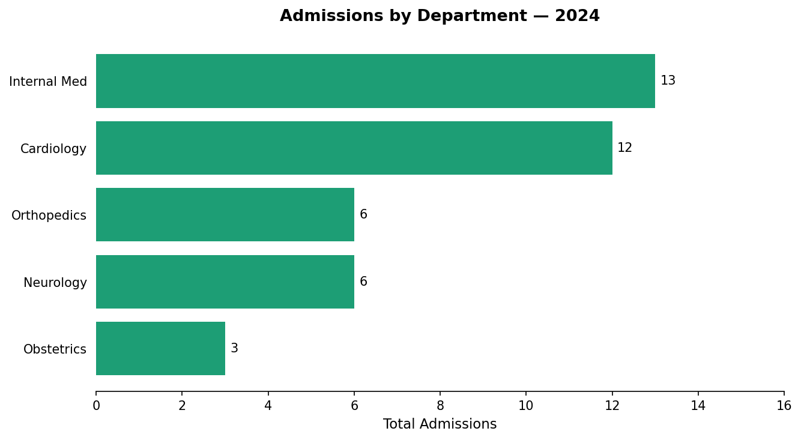
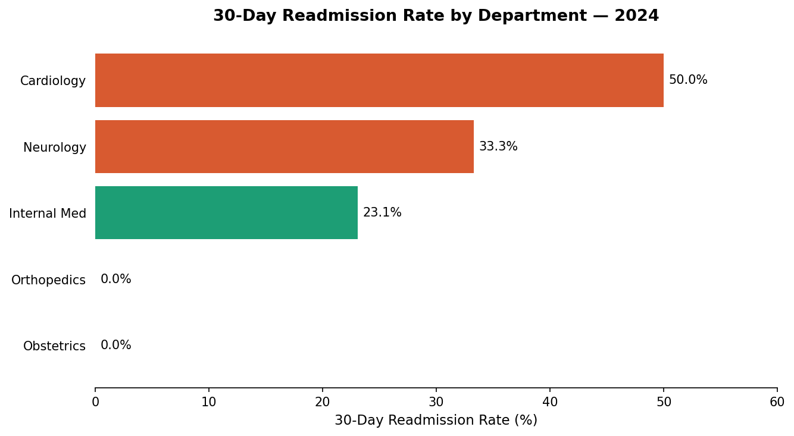

# 🏥 Healthcare Analytics SQL Project

> End-to-end healthcare data analytics project using SQL, Python, and data visualization to uncover clinical insights from a simulated hospital admissions dataset.

---

## 📌 Project Overview

This project simulates a real hospital analytics workflow — querying patient admissions, diagnosing patterns, flagging high-risk patients, and visualizing clinical KPIs. Built using **SQLite** and **Jupyter Notebook** as part of a healthcare data analyst portfolio.

All data is synthetic. No real patient information is used.

---

## 📊 Visualizations

### Comorbidity Heatmap — Which diagnoses appear together most often?


> **Finding:** Type 2 Diabetes most frequently co-occurs with Acute MI (I21.x) and  Pneumonia (J18.9), each sharing 4 admissions — consistent with national data showing diabetes as a driver of both cardiovascular and infectious complications.

---

### Patient Risk Scatter Plot — Outlier patients by admissions, LOS, and diagnosis complexity


> **Finding:** High-risk patients cluster in the top-right quadrant — high admission frequency combined with long average stays. These patients are concentrated in high-acuity conditions such as Heart Failure, COPD, and Acute MI, and represent the highest utilization burden.

---

### Length of Stay Outlier Detection — Spread within each department


> **Finding:** Neurology and Internal Medicine show the widest length-of-stay spread, indicating higher case complexity and variability. Longer stays may reflect complications, social determinants of health barriers, or discharge-planning delays.

---

### Admissions by Department


---

### 30-Day Readmission Rate by Department


> **Finding:** Cardiology shows the highest 30-day readmission rate in this dataset. This aligns with national CMS quality benchmarks, where heart failure and pneumonia are among the top readmission drivers nationally.
---

## 🗃️ Dataset

| Table | Rows | Description |
|---|---|---|
| `patients` | 20 | Demographics, insurance type, zip code |
| `admissions` | 40 | Visit dates, department, admission type |
| `diagnoses` | 40 | ICD-10 codes linked to each admission |

**Departments covered:** Cardiology, Internal Medicine, Neurology, Orthopedics, Obstetrics

**Insurance types:** Medicare, Medicaid, Commercial

---

## 🔍 SQL Queries — Skills Demonstrated

| # | Query | Concepts Used |
|---|---|---|
| 1 | Admissions by department | GROUP BY, ORDER BY |
| 2 | Average length of stay | DATEDIFF, AVG, ROUND |
| 3 | Admissions by insurance type | Multi-table JOIN |
| 4 | Emergency vs elective breakdown | CASE WHEN |
| 5 | Top primary diagnoses | ICD-10 filtering, COUNT DISTINCT |
| 6 | 30-day readmission events | Self JOIN |
| 7 | Readmission rate by department | CTE + LEFT JOIN |
| 8 | High-risk diabetic patients | HAVING + LIKE |
| 9 | Patient visit timeline | ROW_NUMBER, LAG, PARTITION BY |
| 10 | Full patient summary report | Multiple CTEs combined |
| 11 | High-risk patient flagging | Multi-factor CASE WHEN risk score |
| 12 | Readmission rate by diagnosis | CTE + ICD-10 outcome analysis |
| 13 | Department performance scorecard | Executive KPI summary |

---

## 📈 Key Findings

- **Cardiology** has the highest 30-day readmission rate in this dataset - consistent with national CMS benchmarks where cardiac conditions are common readmission drivers. 
- **Type 2 Diabetes** (E11.x) is present in 9 out of 20 patients (45%) - the most common secondary diagnosis across Cardiology, Internal medicine and Neurology
- **Neurology** has the longest average LOS at 8.7 days, more than 4x longer than Obstetrics(2.0 days)
- **Medicare patients** account for the highest admission volume, consistent with an aging patient population
- **High-risk patients** (multiple admissions + high-acuity diagnosis) represent a small proportion of patients but drive a disproportionate share of utilization

---

## 🛠️ Tech Stack

| Tool | Purpose |
|---|---|
| SQLite | Relational database — no server setup required |
| Python 3 | Data loading, query execution |
| Pandas | SQL result handling and display |
| Matplotlib | Data visualization |
| Jupyter Notebook | Interactive analysis environment |
| Anaconda | Environment management |
| Git + GitHub | Version control and portfolio hosting |

---

## 🚀 How to Run

### Requirements
- Anaconda (includes Python, Jupyter, Pandas, Matplotlib)
- No additional installs needed — SQLite is built into Python

### Steps
1. Clone the repo:
   ```bash
   git clone https://github.com/swarnalekhya/healthcare-sql-project.git
   ```
2. Open Anaconda Navigator → Launch Jupyter Notebook
3. Navigate to `healthcare_analytics.ipynb`
4. Run **Kernel → Restart & Run All**

All tables are created and loaded automatically. Results display as formatted tables inline.

---

## 📁 Project Structure

```
healthcare-sql-project/
├── healthcare_analytics.ipynb   # Main notebook — all queries and charts
├── comorbidity_heatmap.png      # Diagnosis co-occurrence heatmap
├── patient_risk_scatter.png     # Patient risk bubble chart
├── los_outlier_boxplot.png      # LOS distribution and outliers
├── admissions_by_department.png # Admissions bar chart
├── readmission_rate.png         # Readmission rate bar chart
└── README.md                    # This file
```

---

## 🏷️ Healthcare Domain Concepts

| Term | Definition |
|---|---|
| LOS | Length of Stay — days between admission and discharge |
| 30-Day Readmission | Patient readmitted within 30 days of prior discharge |
| ICD-10 | International Classification of Diseases — standard diagnosis coding system |
| Comorbidity | Two or more conditions present in the same patient |
| Risk Stratification | Categorizing patients by complexity and utilization risk |
| CMS | Centers for Medicare & Medicaid Services — sets national quality benchmarks |

---


*All data in this project is synthetic and for educational purposes only.*
